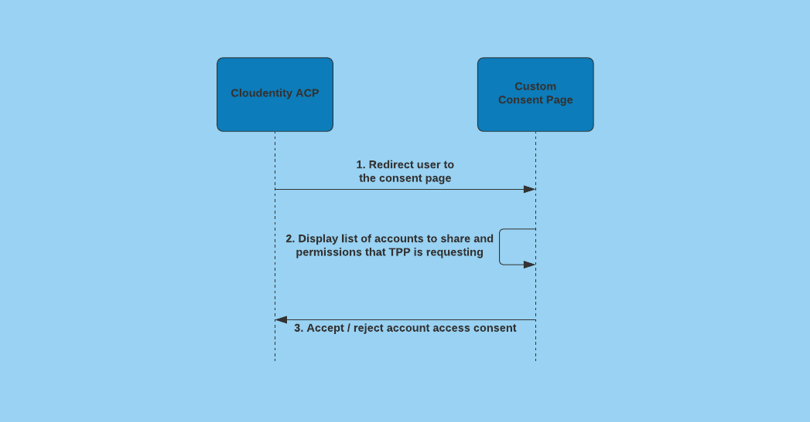

# Implementing Custom Consent Page with Node.js

In this specific article , we will be creating a Node.js application that will display requested scopes to the end user of an OAuth application.  The end user will have the option to customize the request consents or reject them altogether. We will be using the [Cloudentity Authorization Platform](https://authz.cloudentity.io/) for our authorization server.

### Prerequisites

##### Cloudentity SaaS
Cloudentity offers a free SaaS Tenant and you can sign up for one, if you have not already, for a free account. With this you are basically getting a free OAuth/OIDC compliant server with all the latest specifications comprising of OpenData initiatives across the world.

##### Go Application
- [Node.js](https://nodejs.org) - Recommended v17.0.1 +
- [ExpressJS](https://expressjs.com) - Recommended 4.16.1 +

### Basic Concepts
When a user log in to and is authenticated to an OAuth server the user is shown a consent page where the user can accept or reject consents. [Cloudentity Authorization Platform](https://authz.cloudentity.io/) allows the client to set up a custom consent page. There can be a number of reason where a client would like a custom consent page, one of which is OpenBanking. 

An overview of the flow can be seen in the image below.


First, the user agent is redirected to [Cloudentity Authorization Platform](https://authz.cloudentity.io/) authorization server, where the user logs in and is authenticated. Once authenticated, [Cloudentity Authorization Platform](https://authz.cloudentity.io/) authorization server then redirects the user to the application hosting the custom consent page . The application then calls ACP-internal API to retrieve details on the account access consents. The applicatiojn displays the consents to the user and the user can accept all, reject all, or accept only some of the consents. Once a selection is made the application redirects the user back to [Cloudentity Authorization Platform](https://authz.cloudentity.io/) authorization server.

### Preparing Cloudentity SaaS
First, we create a new workspace for this tutorial. 

From the Authorization Workspaces page, choose 'Create'.  Select 'Demo Environment' from the type of applications and services.  Enter a Display Name of your choosing and select 'Enable demo application' then select 'Next'.  On the Identify Pools page, under 'Custom and test connections', choose 'Sandbox IDP'. Give the Sandbox IDP a name and enter a Username and Password then select 'Next'. On the 'Create developer portal' page optionally add a developer portal or choose 'Skip'. You will then be redirected to the Authorization Workspaces page.

Select your new workspace and on the left navigation panel choose Auth Settings->Consent. Then select ‘Open Banking Consent’. In the ‘Consent URL’ field add your callback URL. In our app we add a callback of `http://localhost:4001/consent`. Note: The port for this sample app can be changed in .env.  

Make note of the `CLIENT ID` and `CLIENT SECRET` as we will be using these in our application. They will be entered in the `.env` file a the root of the project. Also, make note of your `Tenant ID` in the top right. 

On the left navigation menu choose Auth Settings->OAuth and from the General tab copy the `Authorization Server URL`.

Your workspace is now ready and will redirect the user to the custom consent page of our Node.js application after the user authenticates.

### Building the Node.js application
In the sample application repo, from the root of the project open the .env and add your `CLIENT_ID`, `CLIENT_SECRET`, `AUTHORIZATION_SERVER_URL`, and `TENANT_ID` that was copied previously.

`app.js` is just boilerplate for setting up our Express.js application and specifying that we are using Handlebars.js for our view engine.

Inside the `routes` folder lets look at index.js. index.js contains our handlers and the code for obtaining the consent request, getting an authorization token, and accepting or denying the consent request. 

First, we get our environment variables.
```
const tenant_id = process.env.TENANT_ID;
const issuer_url = process.env.AUTHORIZATION_SERVER_URL;
const client_id = process.env.CLIENT_ID;
const client_secret = process.env.CLIENT_SECRET;
```

When we enabled a custom consent page in [Cloudentity Authorization Platform](https://authz.cloudentity.io/) an application was created for us in the System workspace. This application has grant type `client credentials` and `Client Secret Basic` as the Token Endpoint Authentication Method. Using the `CLIENT_ID` and `CLIENT_SECRET` we prepare our token which will be used for getting an access token.
```
const auth_token = Buffer.from(`${client_id}:${client_secret}`, 'utf-8').toString('base64');
```

Next, we add a root path just for checking that our application is running and responding to requests. 
```
router.get('/', function (req, res, next) {
  res.render('health');
});
```

Next we had a route for `/consent`. This is our redirect URI that ACP will redirect users to after they authenticate. The process for handling the custom consent page callback is found here [Integrating the custom consent page with ACP](https://docs.authorization.cloudentity.com/guides/ob_guides/custom_consent_page/?q=custom%20consent). We get the login id and login state params. If they are missing we display an error and return. Once we have our login id and state we then `getScopGrants`.
```
router.get('/consent', (req, res) => {
  const login_id = req.query.login_id;
  const state = req.query.login_state;
  if (state == null || login_id == null) {
    res.render('error', { msg: 'missing state and/or login id' });
    return;
  }

  appState.id = login_id
  appState.state = state

  getScopeGrants(res);
});
```

`getScopeGrants` kicks off the process of obtaining an access token and then making the scope grant request. 
```
const getScopeGrants = async (res) => {
  // An access token is required for making a scope grant request.
  appState.access_token = await getAccessToken(res);
  if (appState.access_token == null) {
    return;
  }

  // Once we have an access token we make an API call for a scope grant request.
  getScopeGrantRequest(res);
}
```
We make a request to the token endpoint for our access token using the  [ACP API](https://docs.authorization.cloudentity.com/api/oauth2/#operation/token).
```
const getAccessToken = async (res) => {
  try {
    const data = qs.stringify({ grant_type: 'client_credentials', scope: 'manage_scope_grants', state: appState.access_token });

    const options = {
      method: 'POST',
      url: origin + '/' + tenant_id + '/system/oauth2/token',
      rejectUnauthorized: false,
      headers: {
        'Content-Type': 'application/x-www-form-urlencoded',
        Authorization: 'Basic ' + auth_token
      },
      data: data
    };

    const response = await axiosInstance(options);
    return response.data.access_token;
  } catch (error) {
    console.log(error);
    res.render('error', { msg: 'error getting access token: ' + error });
  }
}
```

Once we obtain an access token we make the scope grant request using the [ACP Consent Request API](https://docs.authorization.cloudentity.com/api/system/#operation/getScopeGrantRequest).
```
const getScopeGrantRequest = async (res) => {
  const options = {
    url: origin + '/api/system/' + tenant_id + '/scope-grants/' + appState.id + '?login_state=' + appState.state,
    method: "GET",
    headers: {
      'Content-Type': 'application/x-www-form-urlencoded',
      'Authorization': 'Bearer ' + appState.access_token,
    }
  }

  try {
    const response = await axiosInstance(options);
    appState.redirectURI = response.data.request_query_params.redirect_uri[0];
    res.render('consent', { scopes: response.data.requested_scopes });
  } catch (error) {
    console.log(error);
    res.render('error', { msg: 'error getting scope grants: ' + error });
  }
}
```

The response from the scope grant request will include the requested scopes. We then display the requested scopes to the user. The user can then choose which, if any, scopes they will allow or they can reject the request for access altogether. 

If the user rejects the request we prepare to notify ACP using the [ACP Reject Login Request API](https://docs.authorization.cloudentity.com/api/system/#operation/rejectLoginRequest). 
```
router.get('/reject', function (req, res, next) {
  const data = JSON.stringify({ id: appState.id, login_state: appState.state });
  handleConsent(res, 'reject', data);
});
```

If the user accepts some or all of the scopes then we get the scopes the user has accepted and prepare to notify ACP using the [ACP Accept Login Request API](https://docs.authorization.cloudentity.com/api/system/#operation/acceptLoginRequest). 
```
router.post('/accept', function (req, res, next) {
  let scopes = [];
  for (const val in req.body) {
    scopes.push(val);
  }
  const data = JSON.stringify({ granted_scopes: scopes, id: appState.id, login_state: appState.state });
  handleConsent(res, 'accept', data);
});
```

Finally, we notify ACP of the acceptance or rejection of the requested scope. The response from ACP will include a body with `redirect_to` field. We then redirect the user to the provided redirect URI which sends the user agent back to ACP.
```
const handleConsent = async (res, consent, data) => {
  const options = {
    url: origin + '/api/system/' + tenant_id + '/scope-grants/' + appState.id + '/' + consent,
    method: "POST",
    headers: {
      'Content-Type': 'application/x-www-form-urlencoded',
      'Authorization': 'Bearer ' + appState.access_token,
    },
    data: data
  }

  try {
    let acceptRes = await axiosInstance(options)
    res.redirect(acceptRes.data.redirect_to);
  } catch (error) {
    console.log(error);
    res.render('error', { msg: 'failed to submit consent acceptance: ' + error });
  }
}
```

### Conclusion
ACP makes it easy to use a custom consent page, if desired. With very little configuration in ACP and just a few lines of code we were able to implement the custom consent page using Node.js. 

### Relevant Links
 - [RFC 6749](https://datatracker.ietf.org/doc/html/rfc6749)
 - [Building the Open-Banking-compliant consent page with ACP](https://docs.authorization.cloudentity.com/guides/ob_guides/consent_pg/)
 - [Integrating the custom consent page with ACP](https://docs.authorization.cloudentity.com/guides/ob_guides/custom_consent_page/?q=custom%20consent)
 - [Enabling the custom consent page in ACP](https://docs.authorization.cloudentity.com/guides/ob_guides/custom_consent_intro/?q=custom%20consent)


